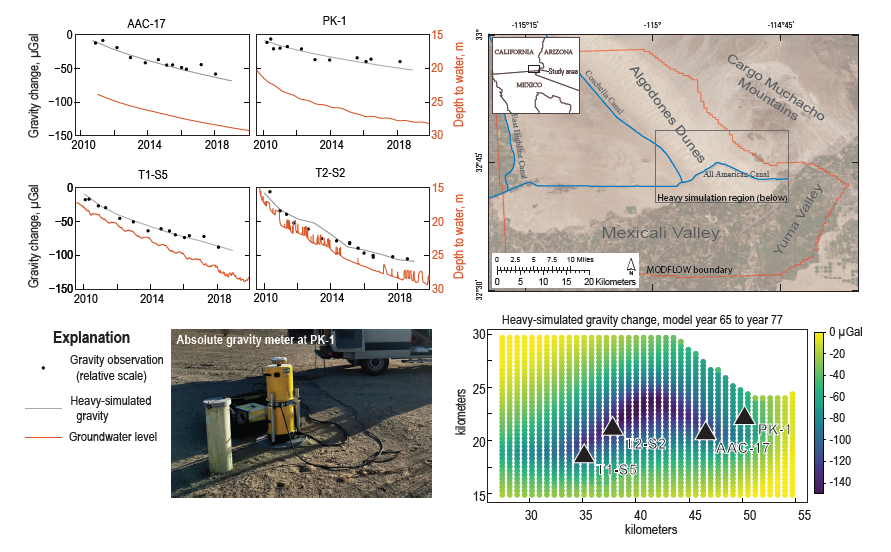
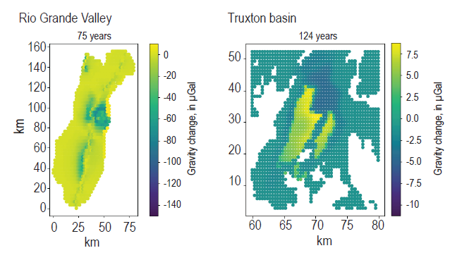

Three previously published example models are provided with Heavy.

## All American Canal

A single-layer MODFLOW-NWT model (Wildermuth and Kennedy, 2022) of the All American Canal in southeast California, USA, simulates the dissipation of a groundwater mound following the concrete-lining of the Canal to reduce seepage losses (Kennedy and others, 2021). This model was used to demonstrate model calibration with a field repeat microgravity dataset (U.S. Geological Survey, 2021). 

## Rio Grande Valley (Albuquerque, NM)

A multilayer MODFLOW-2005 model for the Rio Grande Valley near Albuquerque, New Mexico demonstrates layer property flow and complex use of zones and arrays (Meyers and Friesz, 2019).

## Truxton basin, northwest Arizona

A 4-layer MODFLOW-NWT model (Knight, 2020a) from northwest Arizona demonstrates upstream weighting and unconfined storage in multiple layers. Storage changes in this model occur in response to groundwater pumping (Knight, 2020b); the complex pattern of predicted gravity change (Figure below) reflects the distribution of storage properties in the groundwater model, which were based on a detailed airborne electromagnetic survey (Ball et al., 2019). 

### References

Ball, L.B., 2020. Major hydrostratigraphic contacts of the Truxton basin and Hualapai Plateau, northwestern Arizona, developed from airborne electromagnetic data, chap. D of Mason, J.P., ed., Geophysical surveys, hydrogeologic characterization, and groundwater flow model for the Truxton basin and Hualapai Plateau, northwestern Arizona: U.S. Geological Survey Scientific Investigations Report 2020–5017, [https://doi.org/10.3133/sir20205017D](https://doi.org/10.3133/sir20205017D)

Kennedy, J., R., Wildermuth, L., Knight, J.E., and Larsen, J., 2021, Improving groundwater model calibration with repeat microgravity measurements, Groundwater, [https://doi.org/10.1111/gwat.13167](https://doi.org/10.1111/gwat.13167)

Knight, J.E., 2020a. MODFLOW-NWT groundwater model used for simulating potential future pumping scenarios and forecasting associated groundwater-level changes in the Truxton aquifer on the Hualapai Reservation and adjacent areas, Mohave County, Arizona. U.S. Geological Survey data release, [https://doi.org/10.5066/P9O2WGLS](https://doi.org/10.5066/P9O2WGLS)

Knight, J.E., 2020b, Simulation of groundwater-level changes from projected groundwater withdrawals in the Truxton basin, northwestern Arizona, chap. E of Mason, J.P., ed., Geophysical surveys, hydrogeologic characterization, and groundwater flow model for the Truxton basin and Hualapai Plateau, northwestern Arizona: U.S. Geological Survey Scientific Investigations Report 2020–5017, [https://doi.org/10.3133/sir20205017E](https://doi.org/10.3133/sir20205017E)

Myers, N.C., Friesz, P.J., 2019. Hydrogeologic framework and delineation of transient areas contributing recharge and zones of contribution to selected wells in the upper Santa Fe Group aquifer, southeastern Albuquerque, New Mexico, 1900–2050. U.S. Geological Survey Scientific Investigations Report 2019–5052, [https://doi.org/10.3133/sir20195052](https://doi.org/10.3133/sir20195052)

U.S. Geological Survey, 2021, Southwest Gravity Program Absolute-Gravity Database (updated 2022-12-08): U.S. Geological Survey data release, [https://doi.org/10.5066/P984HN6J](https://doi.org/10.5066/P984HN6J)

Wildermuth, L., Kennedy, J., 2022, MODFLOW-NWT groundwater model demonstrating groundwater model calibration with repeat microgravity measurements, U.S. Geological Survey Data Release, [https://doi.org/10.5066/P9575C61](https://doi.org/10.5066/P9575C61)